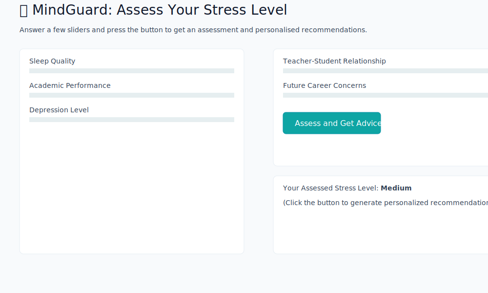
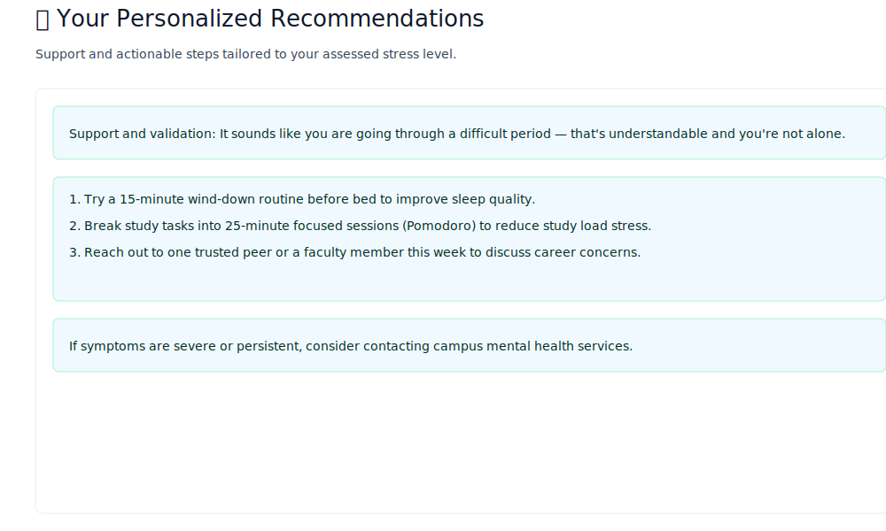

Introduction

MindGuard — An Intelligent Assistant for Student Stress Management

This repository contains code, analysis, and a lightweight demo for "MindGuard": a student stress-assessment project that combines data analysis, machine learning, and an AI-powered recommendations layer.

Aim and Goals
- Aim: Provide a simple, reproducible pipeline that demonstrates how student wellbeing can be assessed from survey-style features and how personalized recommendations can be generated.
- Short-term goals:
   - Provide exploratory data analysis (EDA) on a stress dataset.
   - Train a baseline classifier to predict stress level (Low / Medium / High).
   - Offer a small, runnable demo so the project can be explored without heavy dependencies (H2O, Java, or cloud AI APIs).
- Long-term goals (next steps): integrate the H2O AutoML model, wire the Streamlit UI (`app.py`) to a production model, and safely integrate an external generative AI (Gemini) to provide personalized advice.

What is included
- `app.py` — Streamlit front-end that was developed to serve an H2O model and query the Gemini generative API for advice. Note: the original app expects an H2O model and Java; see notes below.
- `model.py` — Exploratory Data Analysis (EDA) and visualizations for the stress dataset.
- `data/StressLevelDataset.csv` — A small synthetic sample dataset (added so you can run a minimal pipeline locally).
- `simple_demo.py` — A lightweight end-to-end demo: trains a RandomForest classifier on the sample data and shows predictions. This is provided so you can run a full flow without H2O/Java or cloud keys.
- `requirements.txt` — Python dependencies (updated to include the demo requirements).
- `MindGuard_An_Intelligent_Assistant_for_Student_Stress_Management_FinalProoposal.pptx` — Presentation file (kept as-is). It likely contains additional project requirements, motivation, and analysis.

Quick overview / architecture

1. Data (CSV) -> 2. EDA (`model.py`) -> 3. Model training (demo uses scikit-learn) -> 4. Prediction and recommendation (Streamlit + optional generative model in `app.py`).

Minimal reproducible demo (recommended first run)

1. Create & activate a virtual environment
```bash
python -m venv .venv
source .venv/bin/activate
```

2. Install dependencies
```bash
pip install -r requirements.txt
```

3. Run the lightweight demo (this will train a simple RandomForest on the small sample dataset and save a model)
```bash
python simple_demo.py
```

What the demo does
- Loads `data/StressLevelDataset.csv`.
- Trains a RandomForest classifier to predict `stress_level` (0=Low, 1=Medium, 2=High).
- Prints a classification report and saves a small model file `rf_stress_model.joblib`.
- Demonstrates predicting on an input sample.

Notes about the Streamlit app (`app.py`)
- `app.py` is written to use H2O models and to call the Google generative AI (Gemini). To run `app.py` as originally intended you need:
   - Java JDK installed and `H2O_JAVA_HOME` correctly set (the file hard-codes a Windows JDK path; update `JAVA_HOME_PATH` accordingly for macOS/linux).
   - A saved H2O model directory (the app references `MODEL_PATH = "XGBoost_1_AutoML_1_20251102_85004"`).
   - A Google API key in a `.env` file for the `google-generativeai` usage (optional).

If you don't have these components, use `simple_demo.py` to experiment quickly. If you want, I can help:
- convert the Streamlit app to use the scikit-learn model from the demo;
- or help export an H2O model to a portable format and wire it into `app.py`.

Presentation and further info
- The project presentation `MindGuard_An_Intelligent_Assistant_for_Student_Stress_Management_FinalProoposal.pptx` appears in the repository root. It likely contains project motivation, dataset descriptions, and proposed model architectures. If you want, I can extract its text and slides into a Markdown summary (I can do that automatically if you want me to install and run `python-pptx` locally).

 Files added/changed in this update
 - `README.md` — this file (expanded with aim, goals, and instructions).
 - `data/StressLevelDataset.csv` — small synthetic sample dataset (so the EDA and demo can run).
 - `simple_demo.py` — small training & predict demo using scikit-learn.
 - `requirements.txt` — updated with extra packages for the demo and optional PPTX extraction.

 Screenshots
 -----------------
 Below are example screenshots of the application UI. These are illustrative SVG mockups created from the app layout so you can preview the UI without running the Streamlit app. The images are stored in `assets/screenshots/`.

 Main interface (sliders and assess button):

 

 Recommendations / result view:

 
---
